COllege Major Outlook: Difference between STEM and non-STEM - Spring
2020
================
true

# **PROJECT WORK**

Project Proposal Questions// Brainstorming \~ pertaining to my portion
only  
Salary difference between STEM majors and NON-STEM majors  
How do different categories of majors stack up against each other like
engineering majors to science to math to arts  
What majors are the most popular college degrees  
Unemployment rates respective to the major

**loading necessary packages**

``` r
#libraries used for project
library(tidyverse) # for `ggplot2`, `dplyr`, and more
## -- Attaching packages ----------------------------------------------------------------------------------------------------------------------------------- tidyverse 1.2.1 --
## v ggplot2 3.1.0     v purrr   0.3.0
## v tibble  2.0.1     v dplyr   0.7.8
## v tidyr   0.8.2     v stringr 1.3.1
## v readr   1.3.1     v forcats 0.3.0
## -- Conflicts -------------------------------------------------------------------------------------------------------------------------------------- tidyverse_conflicts() --
## x dplyr::filter() masks stats::filter()
## x dplyr::lag()    masks stats::lag()
library(readr) #read excel csv files, downloaded from kaggle 
library(dplyr)
library(gridExtra)
## 
## Attaching package: 'gridExtra'
## The following object is masked from 'package:dplyr':
## 
##     combine
library(ISLR)
library(tibble)
library(boot)
## 
## Attaching package: 'boot'
## The following object is masked from 'package:lattice':
## 
##     melanoma
library(scales)
## 
## Attaching package: 'scales'
## The following object is masked from 'package:purrr':
## 
##     discard
## The following object is masked from 'package:readr':
## 
##     col_factor
library(class)
```

### (I.) Data Wrangling & Cleaning

**Data was extracted from Kaggle website, using readr library to read
and store the csv file/our data of interest into ‘recentgrads’ object.**

``` r
##main data
recentgrads <- read_csv(file = "C:/Users/sathw/Downloads/DS/collegemajor_project/raw/recent-grads.csv")
## Parsed with column specification:
## cols(
##   .default = col_double(),
##   Major = col_character(),
##   Major_category = col_character()
## )
## See spec(...) for full column specifications.
recentgrads
## # A tibble: 173 x 21
##     Rank Major_code Major Total   Men Women Major_category ShareWomen
##    <dbl>      <dbl> <chr> <dbl> <dbl> <dbl> <chr>               <dbl>
##  1     1       2419 PETR~  2339  2057   282 Engineering         0.121
##  2     2       2416 MINI~   756   679    77 Engineering         0.102
##  3     3       2415 META~   856   725   131 Engineering         0.153
##  4     4       2417 NAVA~  1258  1123   135 Engineering         0.107
##  5     5       2405 CHEM~ 32260 21239 11021 Engineering         0.342
##  6     6       2418 NUCL~  2573  2200   373 Engineering         0.145
##  7     7       6202 ACTU~  3777  2110  1667 Business            0.441
##  8     8       5001 ASTR~  1792   832   960 Physical Scie~      0.536
##  9     9       2414 MECH~ 91227 80320 10907 Engineering         0.120
## 10    10       2408 ELEC~ 81527 65511 16016 Engineering         0.196
## # ... with 163 more rows, and 13 more variables: Sample_size <dbl>,
## #   Employed <dbl>, Full_time <dbl>, Part_time <dbl>,
## #   Full_time_year_round <dbl>, Unemployed <dbl>, Unemployment_rate <dbl>,
## #   Median <dbl>, P25th <dbl>, P75th <dbl>, College_jobs <dbl>,
## #   Non_college_jobs <dbl>, Low_wage_jobs <dbl>

### data we thought of using
# allages <- read.csv(file = "all-ages.csv") 
# gradstudents <- read.csv(file = "grad-students.csv")
# allages
# gradstudents
```

**Since my portion of the project focuses on drawing comparisons between
STEM and NONSTEM, I needed to acquire the proper subsets. Furthermore, I
chose which category falls under which sector.**  
**There are about 16 Major categories. 86 majors in STEM and 78 majors
in NONSTEM. Pyschology appears in both categories.**

``` r
## go through each of the files and determine whether each record is stem or non-stem
## recentgrads data 
majors <- recentgrads %>%
  select(Major_category) %>%
  distinct()
majors
```

    ## # A tibble: 16 x 1
    ##    Major_category                     
    ##    <chr>                              
    ##  1 Engineering                        
    ##  2 Business                           
    ##  3 Physical Sciences                  
    ##  4 Law & Public Policy                
    ##  5 Computers & Mathematics            
    ##  6 Agriculture & Natural Resources    
    ##  7 Industrial Arts & Consumer Services
    ##  8 Arts                               
    ##  9 Health                             
    ## 10 Social Science                     
    ## 11 Biology & Life Science             
    ## 12 Education                          
    ## 13 Humanities & Liberal Arts          
    ## 14 Psychology & Social Work           
    ## 15 Communications & Journalism        
    ## 16 Interdisciplinary

``` r
STEM <- filter(recentgrads, recentgrads$Major_category == "Engineering" 
               | recentgrads$Major_category == "Physical Sciences" 
               | recentgrads$Major_category == "Computers & Mathematics"
               | recentgrads$Major_category == "Agriculture & Natural Resources"
               | recentgrads$Major_category == "Health"
               | recentgrads$Major_category == "Biology & Life Science")

STEM
```

    ## # A tibble: 86 x 21
    ##     Rank Major_code Major Total   Men Women Major_category ShareWomen
    ##    <dbl>      <dbl> <chr> <dbl> <dbl> <dbl> <chr>               <dbl>
    ##  1     1       2419 PETR~  2339  2057   282 Engineering         0.121
    ##  2     2       2416 MINI~   756   679    77 Engineering         0.102
    ##  3     3       2415 META~   856   725   131 Engineering         0.153
    ##  4     4       2417 NAVA~  1258  1123   135 Engineering         0.107
    ##  5     5       2405 CHEM~ 32260 21239 11021 Engineering         0.342
    ##  6     6       2418 NUCL~  2573  2200   373 Engineering         0.145
    ##  7     8       5001 ASTR~  1792   832   960 Physical Scie~      0.536
    ##  8     9       2414 MECH~ 91227 80320 10907 Engineering         0.120
    ##  9    10       2408 ELEC~ 81527 65511 16016 Engineering         0.196
    ## 10    11       2407 COMP~ 41542 33258  8284 Engineering         0.199
    ## # ... with 76 more rows, and 13 more variables: Sample_size <dbl>,
    ## #   Employed <dbl>, Full_time <dbl>, Part_time <dbl>,
    ## #   Full_time_year_round <dbl>, Unemployed <dbl>, Unemployment_rate <dbl>,
    ## #   Median <dbl>, P25th <dbl>, P75th <dbl>, College_jobs <dbl>,
    ## #   Non_college_jobs <dbl>, Low_wage_jobs <dbl>

``` r
NONSTEM <- filter(recentgrads, recentgrads$Major_category == "Business"
                  | recentgrads$Major_category == "Law & Public Policy"
                  | recentgrads$Major_category == "Industrial Arts & Consumer Services"
                  | recentgrads$Major_category == "Arts"
                  | recentgrads$Major_category == "Social Science" 
                  | recentgrads$Major_category == "Education"
                  | recentgrads$Major_category == "Humanities & Liberal Arts"
                  | recentgrads$Major_category == "Pyschology & Social Work"
                  | recentgrads$Major_category == "Communications & Journalism"
                  | recentgrads$Major_category == "Interdisciplinary")

NONSTEM
```

    ## # A tibble: 78 x 21
    ##     Rank Major_code Major  Total    Men Women Major_category ShareWomen
    ##    <dbl>      <dbl> <chr>  <dbl>  <dbl> <dbl> <chr>               <dbl>
    ##  1     7       6202 ACTU~   3777   2110  1667 Business           0.441 
    ##  2    20       3201 COUR~   1148    877   271 Law & Public ~     0.236 
    ##  3    25       6212 MANA~  18713  13496  5217 Business           0.279 
    ##  4    27       5601 CONS~  18498  16820  1678 Industrial Ar~     0.0907
    ##  5    28       6204 OPER~  11732   7921  3811 Business           0.325 
    ##  6    30       5402 PUBL~   5978   2639  3339 Law & Public ~     0.559 
    ##  7    33       6099 c       3340   1970  1370 Arts               0.410 
    ##  8    36       6207 FINA~ 174506 115030 59476 Business           0.341 
    ##  9    37       5501 ECON~ 139247  89749 49498 Social Science     0.355 
    ## 10    38       6205 BUSI~  13302   7575  5727 Business           0.431 
    ## # ... with 68 more rows, and 13 more variables: Sample_size <dbl>,
    ## #   Employed <dbl>, Full_time <dbl>, Part_time <dbl>,
    ## #   Full_time_year_round <dbl>, Unemployed <dbl>, Unemployment_rate <dbl>,
    ## #   Median <dbl>, P25th <dbl>, P75th <dbl>, College_jobs <dbl>,
    ## #   Non_college_jobs <dbl>, Low_wage_jobs <dbl>

### (II.) Assessing Data

**Briefing over some descriptive statistics I wanted to analyze.**  
**Petroleum Engineering has low unemployment rate and a high median
salary. Biology, Computer Science, Business, and Accounting are the most
impacted majors. There exists a major called Metallurgical engineering
which is the study of metals.**

``` r
#finding top 5 stem median salaries
STEM_mediansalary <- group_by(STEM, Major)
sal_sum <- summarise(STEM_mediansalary, med_salary = Median)
med_sal_STEM <- arrange(sal_sum, desc(med_salary))
head(med_sal_STEM, 5)
## # A tibble: 5 x 2
##   Major                                     med_salary
##   <chr>                                          <dbl>
## 1 PETROLEUM ENGINEERING                         110000
## 2 MINING AND MINERAL ENGINEERING                 75000
## 3 METALLURGICAL ENGINEERING                      73000
## 4 NAVAL ARCHITECTURE AND MARINE ENGINEERING      70000
## 5 CHEMICAL ENGINEERING                           65000

#finding top 5 non stem median salaries
NONSTEM_mediansalary <- group_by(NONSTEM, Major)
nsal_sum <- summarise(NONSTEM_mediansalary, med_salary = Median)
med_sal_NONSTEM <- arrange(nsal_sum, desc(med_salary))
head(med_sal_NONSTEM, 5)
## # A tibble: 5 x 2
##   Major                                         med_salary
##   <chr>                                              <dbl>
## 1 ACTUARIAL SCIENCE                                  62000
## 2 COURT REPORTING                                    54000
## 3 MANAGEMENT INFORMATION SYSTEMS AND STATISTICS      51000
## 4 c                                                  50000
## 5 CONSTRUCTION SERVICES                              50000

#finding top5 most popular in STEM
STEM_majors <- group_by(STEM, Major)
overview <- summarise(STEM_majors, total = sum(Total))
most_popularSTEM <- arrange(overview, desc(total))
head(most_popularSTEM, 5)
## # A tibble: 5 x 2
##   Major                   total
##   <chr>                   <dbl>
## 1 BIOLOGY                280709
## 2 NURSING                209394
## 3 COMPUTER SCIENCE       128319
## 4 MECHANICAL ENGINEERING  91227
## 5 ELECTRICAL ENGINEERING  81527

#finding top5 most popular in NONSTEM
NONSTEM_majors <- group_by(NONSTEM, Major)
overview <- summarise(NONSTEM_majors, total = sum(Total))
most_popularNONSTEM <- arrange(overview, desc(total))
head(most_popularNONSTEM, 5)
## # A tibble: 5 x 2
##   Major                                   total
##   <chr>                                   <dbl>
## 1 BUSINESS MANAGEMENT AND ADMINISTRATION 329927
## 2 GENERAL BUSINESS                       234590
## 3 COMMUNICATIONS                         213996
## 4 MARKETING AND MARKETING RESEARCH       205211
## 5 ACCOUNTING                             198633

#finding top 5 lowest unemployment rates for STEM 
unemploymentrateSTEM_majors <- group_by(STEM, Major)
rate <- summarise(unemploymentrateSTEM_majors, unemployment_rate = Unemployment_rate)
least_unemployment_rate_STEM <- arrange(rate, -desc(unemployment_rate))
head(least_unemployment_rate_STEM, 5)
## # A tibble: 5 x 2
##   Major                                     unemployment_rate
##   <chr>                                                 <dbl>
## 1 BOTANY                                              0      
## 2 MATHEMATICS AND COMPUTER SCIENCE                    0      
## 3 SOIL SCIENCE                                        0      
## 4 ENGINEERING MECHANICS PHYSICS AND SCIENCE           0.00633
## 5 PETROLEUM ENGINEERING                               0.0184


#finding top 5 lowest unemployment rates  for NONSTEM
unemploymentrateNONSTEM_majors <- group_by(NONSTEM, Major)
un_rate <- summarise(unemploymentrateNONSTEM_majors, unemployment_rate = Unemployment_rate)
least_unemployment_rate_NONSTEM <- arrange(un_rate, -desc(unemployment_rate))
head(least_unemployment_rate_NONSTEM, 5)
## # A tibble: 5 x 2
##   Major                                                    unemployment_ra~
##   <chr>                                                               <dbl>
## 1 EDUCATIONAL ADMINISTRATION AND SUPERVISION                         0     
## 2 MILITARY TECHNOLOGIES                                              0     
## 3 COURT REPORTING                                                    0.0117
## 4 MATHEMATICS TEACHER EDUCATION                                      0.0162
## 5 ELECTRICAL, MECHANICAL, AND PRECISION TECHNOLOGIES AND ~           0.0295
```

### (III.) Exploratory Data Analysis (EDA)

**Data visualization**

``` r
## Objective: Show which major classes fall under which sector; the biggest categories that make up each division
par(mar = c(7, 7, 7, 7))
#coxcomb for STEM by category
STEMbar <- ggplot(data = STEM) +
  geom_bar(mapping = aes(x = Major_category, fill = Major_category), show.legend = F, width = 1) + 
  theme(aspect.ratio = 1) +
  labs(x = NULL,  y = NULL) 
plot2 <- STEMbar + coord_polar()
grid.arrange(plot2, ncol = 2)
```

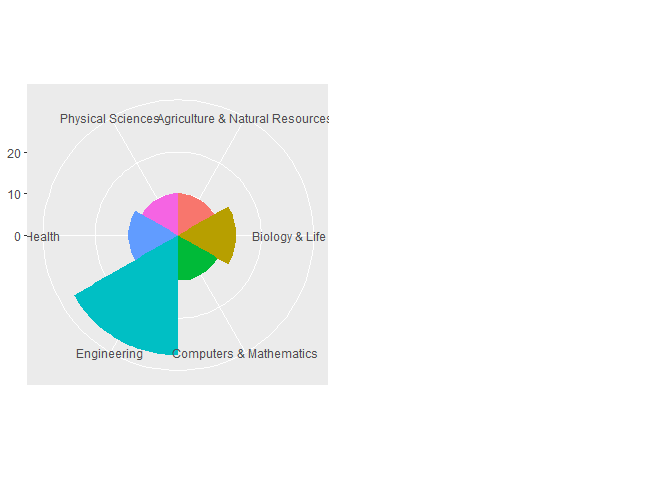<!-- -->

``` r

#coxcomb for NONSTEM by category
NONSTEMbar <- ggplot(data = NONSTEM) +
  geom_bar(mapping = aes(x = Major_category, fill = Major_category), show.legend = F, width = 1) + 
  theme(aspect.ratio = 1) +
  labs(x = NULL,  y = NULL) 
plot2 <- NONSTEMbar + coord_polar()
grid.arrange(plot2, ncol = 1, nrow =1 )
```

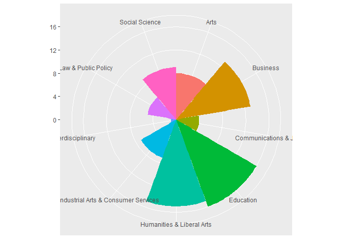<!-- -->

``` r
#histogram for Total number of college students by Major Category for both STEM & NONSTEM 
#STEM
ggplot(data = STEM, mapping = aes(x = Major_category, y = Total)) + 
  geom_histogram(mapping = aes(fill = Major_category), stat = "identity", binwidth = 1000, position = "dodge") + 
  coord_flip()
## Warning: Ignoring unknown parameters: binwidth, bins, pad
## Warning: Removed 1 rows containing missing values (geom_bar).
```

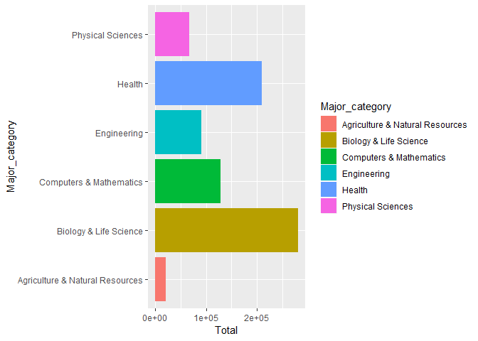<!-- -->

``` r
#NONSTEM
ggplot(data = NONSTEM, mapping = aes(x = Major_category, y = Total)) + 
  geom_histogram(mapping = aes(fill = Major_category), stat = "identity", binwidth = 1000, position = "dodge") + 
  coord_flip()
## Warning: Ignoring unknown parameters: binwidth, bins, pad
```

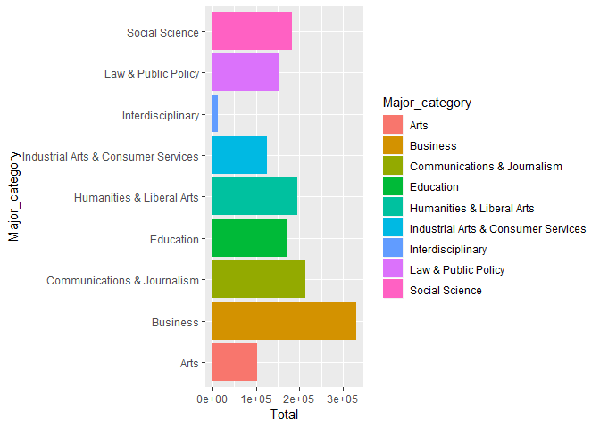<!-- -->

``` r
#histogram for top5 stem median salaries
top5stem <-  head(med_sal_STEM, 5)
ggplot(data = top5stem, mapping= aes(x = Major, y = med_salary)) +
  geom_histogram(mapping = aes(fill= Major),  stat = "identity", show.legend = F) +
  scale_y_continuous(labels = scales::comma) +
  geom_text(mapping = aes(label = med_salary), vjust = 1) +
  labs(title = "Top 5 Median Salaries STEM Major", x = "Major Category", y= "Median Salary") +
  theme(axis.text.x = element_text(size = 10,angle = 55,hjust = 1,vjust = 1))
## Warning: Ignoring unknown parameters: binwidth, bins, pad
```

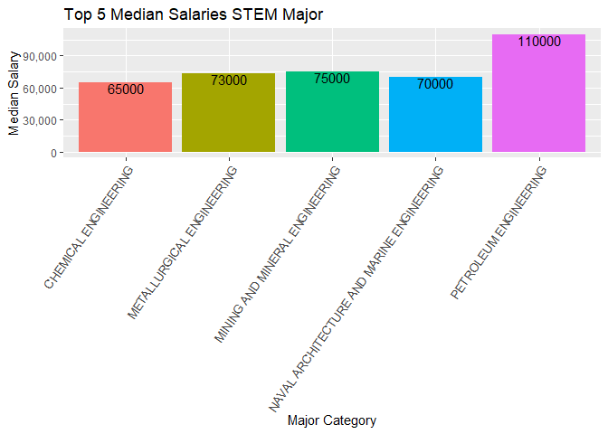<!-- -->

``` r

#histogram for top5 nonstem median salaries
top5nonstem <- head(med_sal_NONSTEM, 5)
ggplot(data = top5nonstem, mapping= aes(x = Major, y = med_salary)) +
  geom_histogram(mapping = aes(fill= Major),  stat = "identity", show.legend = F) +
  scale_y_continuous(labels = scales::comma) +
  geom_text(mapping = aes(label = med_salary), vjust = 1) +
  labs(title = "Top 5 Median Salaries Non-STEM Major", x = "Major Category", y= "Median Salary") +
  theme(axis.text.x = element_text(size = 10,angle = 55,hjust = 1,vjust = 1))
## Warning: Ignoring unknown parameters: binwidth, bins, pad
```

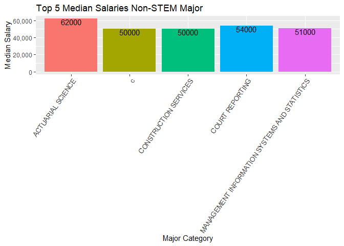<!-- -->

``` r
##boxplots to compare the number of college jobs for each specific major division 
ggplot(data = STEM) +
geom_boxplot(mapping = aes(x = Major_category, y = College_jobs, color = Major_category), show.legend = F) +
  coord_flip()
```

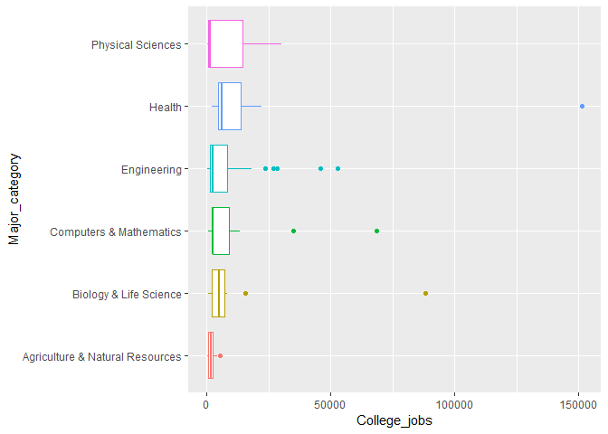<!-- -->

``` r

ggplot(data = STEM, mapping = aes(x = Major_category, y = College_jobs)) +
  geom_violin() +
  coord_flip()
```

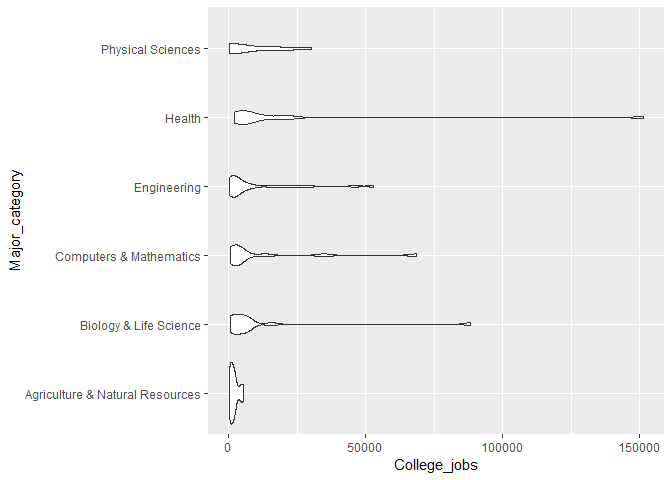<!-- -->

``` r

#Frequency plots to show which industry has the most amount of people employed: STEM or NONSTEM
ggplot(data = STEM) +
  geom_freqpoly(mapping = aes(x = Employed, color = Major_category),
                binwidth = 100000) + 
  scale_x_continuous(labels = scales::comma) +
  labs(title = "STEM Number of Employed")
```

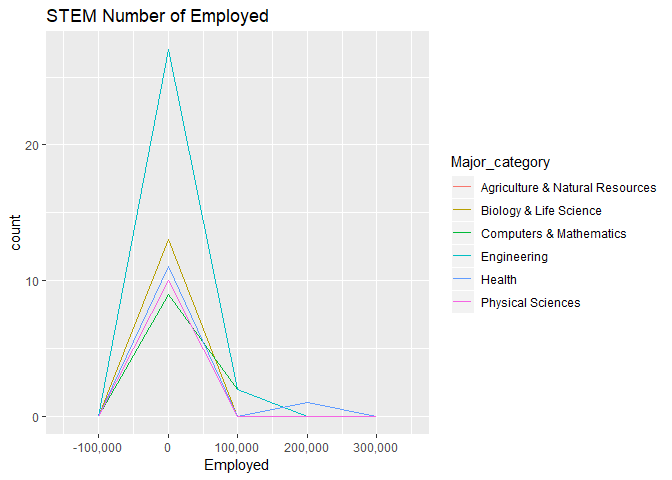<!-- -->

``` r

ggplot(data = NONSTEM) +
  geom_freqpoly(mapping = aes(x = Employed, color = Major_category),
                binwidth = 100000) +
  scale_x_continuous(labels = scales::comma) +
  labs(title = "Non-STEM Number of Employed")
```

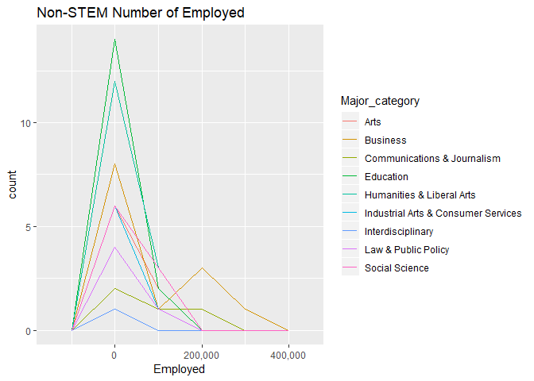<!-- -->

### (IV.) Modeling

``` r
#make a new column; binary => 0s and 1s to label which major is STEM or NONSTEM
recentgrads_SorN <- recentgrads %>% #Creating new table define STEM and NONSTEM as 0s and 1s
  group_by(Major, Major_category) %>%
  mutate(SorN = if(Major_category == "Engineering" | Major_category == "Physical Sciences" | 
                   Major_category == "Computers & Mathematics" | Major_category == "Agriculture & Natural Resources"| Major_category == "Health"| 
                   Major_category == "Biology & Life Science"){
    n = 1 #STEM is 1 
  }else{
    n = 0 #NONSTEM is 0
  }, default = if(Major_category == "Engineering" | Major_category == "Physical Sciences" | 
                   Major_category == "Computers & Mathematics" | Major_category == "Agriculture & Natural Resources"| Major_category == "Health"| 
                   Major_category == "Biology & Life Science"){
    n = "Yes" #STEM is Yes 
  }else{
    n = "No" #NONSTEM is No
  }) %>%
  select(Major, Major_category, SorN, default, Total, Employed, Unemployed, Unemployment_rate, Median, College_jobs)
recentgrads_SorN
## # A tibble: 173 x 10
## # Groups:   Major, Major_category [173]
##    Major Major_category  SorN default Total Employed Unemployed
##    <chr> <chr>          <dbl> <chr>   <dbl>    <dbl>      <dbl>
##  1 PETR~ Engineering        1 Yes      2339     1976         37
##  2 MINI~ Engineering        1 Yes       756      640         85
##  3 META~ Engineering        1 Yes       856      648         16
##  4 NAVA~ Engineering        1 Yes      1258      758         40
##  5 CHEM~ Engineering        1 Yes     32260    25694       1672
##  6 NUCL~ Engineering        1 Yes      2573     1857        400
##  7 ACTU~ Business           0 No       3777     2912        308
##  8 ASTR~ Physical Scie~     1 Yes      1792     1526         33
##  9 MECH~ Engineering        1 Yes     91227    76442       4650
## 10 ELEC~ Engineering        1 Yes     81527    61928       3895
## # ... with 163 more rows, and 3 more variables: Unemployment_rate <dbl>,
## #   Median <dbl>, College_jobs <dbl>
```

**Ran a logistic regression between the ‘SorN’ versus ‘Total’,
‘Unemployment\_rate’, ‘Median’, and ‘College\_jobs’.**  
**Suprisingly for college\_jobs and unemployment\_rate the p-values are
greater than alpha showing that they are NOT significant predictors for
influencing one’s choice to join either STEM or NONSTEM. On the other
hand, median salary and total number of students have p-values less than
alpha = 0.10 indicating that they’re contributors to the decision
between STEM and NONSTEM.**

``` r
# set the random seed so that the analysis is reproducible
set.seed(168)
recentgrads_SorN_idx = sample(nrow(recentgrads_SorN), 86) #splitting the data in half
recentgrads_SorN_trn = recentgrads_SorN[recentgrads_SorN_idx, ] #training data
recentgrads_SorN_tst = recentgrads_SorN[-recentgrads_SorN_idx, ] #testing data
rcg_trn_lm = recentgrads_SorN_trn
rcg_tst_lm = recentgrads_SorN_tst


#logit.fit.all
model_glm_all = glm(SorN ~ Total+Unemployment_rate+Median+College_jobs , 
                    data = recentgrads_SorN_trn, 
                    family = "binomial")
summary(model_glm_all)
## 
## Call:
## glm(formula = SorN ~ Total + Unemployment_rate + Median + College_jobs, 
##     family = "binomial", data = recentgrads_SorN_trn)
## 
## Deviance Residuals: 
##     Min       1Q   Median       3Q      Max  
## -2.1990  -0.8799  -0.4259   0.9935   2.1391  
## 
## Coefficients:
##                     Estimate Std. Error z value Pr(>|z|)   
## (Intercept)       -4.964e+00  1.729e+00  -2.872  0.00408 **
## Total             -1.594e-05  8.836e-06  -1.804  0.07130 . 
## Unemployment_rate  6.261e-01  8.627e+00   0.073  0.94214   
## Median             1.349e-04  4.187e-05   3.223  0.00127 **
## College_jobs       3.065e-05  2.268e-05   1.352  0.17643   
## ---
## Signif. codes:  0 '***' 0.001 '**' 0.01 '*' 0.05 '.' 0.1 ' ' 1
## 
## (Dispersion parameter for binomial family taken to be 1)
## 
##     Null deviance: 117.823  on 84  degrees of freedom
## Residual deviance:  92.102  on 80  degrees of freedom
##   (1 observation deleted due to missingness)
## AIC: 102.1
## 
## Number of Fisher Scoring iterations: 5
```

``` r
model_glm = glm(SorN ~ Median, data = recentgrads_SorN_trn, family = "binomial")

plot(SorN ~ Median, data = rcg_trn_lm, 
     col = "darkorange", pch = "|", ylim = c(0.0, 1.0), xlim=c(20000, 120000), 
     main = "Using Logistic Regression for Classification") 
#axis(1, at = seq(20000, 120000, by = 10000), las=2)
abline(h = 0, lty = 3)
abline(h = 1, lty = 3)
abline(h = 0.5, lty = 2)
curve(predict(model_glm, data.frame(Median = x), type = "response"), 
      add = TRUE, lwd = 3, col = "dodgerblue")
abline(v = -coef(model_glm)[1] / coef(model_glm)[2], lwd = 2)
```

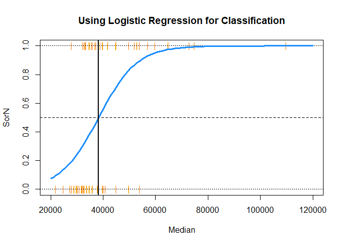<!-- -->

``` r

  
#Estimated conditional probability curve
ggplot(data = recentgrads_SorN, mapping = aes(x = Median)) + ylab("StemorNonSTEM") +
  geom_histogram(mapping = aes(fill = default), 
                 binwidth = 25000, position = 'fill') + 
  geom_smooth(aes(y = SorN), 
              method="glm", method.args=list(family="binomial"), se = F, size = 3) +
  labs(title = "Median Salary: STEMvNONSTEM", x = "Median Salary", y = "STEM(1)NONSTEM(0)")
```

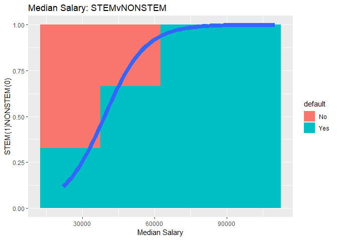<!-- -->

``` r

#scatterplot to visualize Total number of students in that major vs Median salary; group_by STEM or NONSTEM
ggplot(recentgrads_SorN) + 
  geom_point(mapping = aes(x = Total, y = Median, colour = default)) +
  scale_y_continuous(labels = scales::comma) +
  scale_x_continuous(labels = scales::comma)
## Warning: Removed 1 rows containing missing values (geom_point).
```

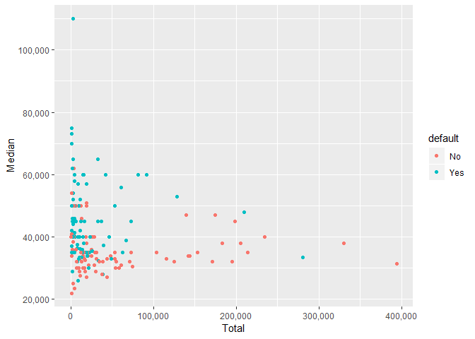<!-- -->

``` r


ggplot(data = recentgrads_SorN, mapping = aes(x = Median, y = SorN)) + 
  geom_point(mapping = aes(color = default)) +
  scale_x_continuous(labels = scales::comma)
```

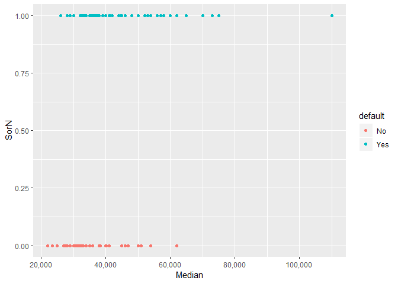<!-- -->

``` r


ggplot(data = recentgrads_SorN, mapping = aes(x = Median)) + 
  geom_histogram(mapping = aes(fill = default), binwidth = 20000, position = "dodge")
```

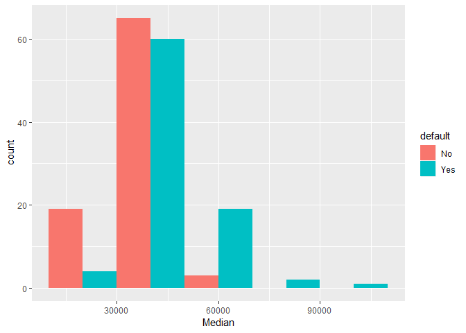<!-- -->

``` r

gg <- ggplot(recentgrads_SorN) + 
  geom_point(aes(x = Total, y = Median, color = default)) # plot test point 
x.test <- c(40000, 50000)
gg + geom_point(x = x.test[1], y = x.test[2], shape = 'X', size = 10) +
  scale_y_continuous(labels = scales::comma) +
  scale_x_continuous(labels = scales::comma)
## Warning: Removed 1 rows containing missing values (geom_point).
```

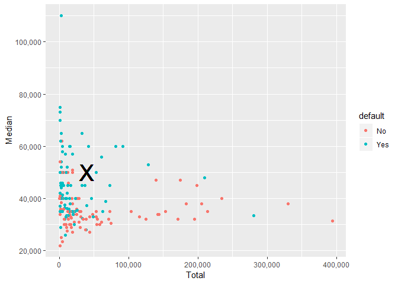<!-- -->

**Nearest Centroid (NC) Classifier**  
**Calculates the difference in means of median salary between the
sectors. Plotted a line segment to visualize the distance.**

``` r
# compute the observed class means 
(obs.means <- recentgrads_SorN %>% 
    group_by(default) %>% 
    select(default, Median, Total) %>%  
    summarise_all(mean, na.rm = TRUE) #ignore mean of total, only to help draw the line segment 
) 
## # A tibble: 2 x 3
##   default Median  Total
##   <chr>    <dbl>  <dbl>
## 1 No      35313. 54677.
## 2 Yes     45047. 23703.
(dist <- obs.means %>% mutate(dist = sqrt((Total - x.test[1])^2 + (Median- x.test[2])^2)))
## # A tibble: 2 x 4
##   default Median  Total   dist
##   <chr>    <dbl>  <dbl>  <dbl>
## 1 No      35313. 54677. 20764.
## 2 Yes     45047. 23703. 17033.
(gg <- ggplot(recentgrads_SorN) + 
    geom_point( mapping = aes(x = Total, y = Median, color = default), alpha = 1.0) +
    geom_point(x = x.test[1], y = x.test[2], shape = 'X', size = 10) + 
    # plot the two class means 
    geom_point(data = obs.means, shape = 'X', size = 10, 
               aes(x = Total, y = Median, color = default)) +
  scale_y_continuous(labels = scales::comma) +
  scale_x_continuous(labels = scales::comma)+ 
    geom_segment(data = dist, aes(x = x.test[1], y = x.test[2], xend = Total, yend = Median))) #add line segment to graph
## Warning: Removed 1 rows containing missing values (geom_point).
```

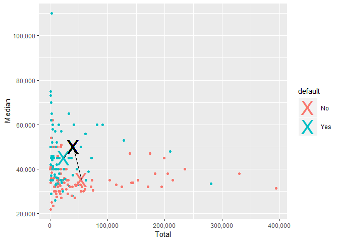<!-- -->

**Misclassification Rate = 30.00578% \<- The perecentage of training and
testing data thats is misclassified.**

``` r
#logistic regression
logit.poly.fit <- glm(SorN ~ Median, family = binomial(), data = recentgrads_SorN) 
#predict the conditional prob
logit.fit.prob <- predict(logit.poly.fit, type = "response") 
#Bayes rule
logit.fit.class <- as.factor(ifelse(logit.fit.prob > 0.5, "Yes", "No"))
#Misclassification error rate
mean(recentgrads_SorN$default != logit.fit.class)
```

    ## [1] 0.300578

``` r
#### SCRATCHWORK JUNK ### IGNORE


# #attempt to combine two tables by joins 
# recentgrads1 <- recentgrads %>%
#   select(-Rank, -ShareWomen, -College_jobs, -Non_college_jobs, -Low_wage_jobs)
# 
# recentgrads1 %>%
#   inner_join(gradstudents, by = c("Major", "Major_category")) %>%
#   select(-Grad_premium, -Grad_share, -Nongrad_total, -Nongrad_employed, -Nongrad_full_time_year_round, -Nongrad_unemployed,-Nongrad_unemployment_rate, -Nongrad_median, -Nongrad_P25, -Nongrad_P75)
# 
# recentgrads1


# training data
# X_recentgrads_SorN_trn = recentgrads_SorN_trn[, -1]
# y_recentgrads_SorN_trn = recentgrads_SorN_trn$SorN
# 
# # testing data
# X_recentgrads_SorN_tst = recentgrads_SorN_tst[, -1]
# y_recentgrads_SorN_tst = recentgrads_SorN_tst$SorN
# 
# 
# 
# 
# knn(train = recentgrads_SorN_trn, 
#          test  = recentgrads_SorN_tst, 
#          cl    = recentgrads_SorN_tst$SorN, 
#          k     = 2, prob = TRUE)


# studentsinSTEM <- function(STEM){
#   sumtotal = 0 
#   for(i in 1:ncol(STEM)){
#     for(i in 1:nrow(STEM)){
#       sumtotal = sumtotal + STEM$Total
#     }
#   }
#   return(sumtotal)
# }
#   
# studentsinSTEM

# total <- STEM %>%
#   summarize(sum = sum(STEM$Total))
# 
# total
#   

#visualization 
# gender_totals <- tibble(mentotal = STEM$Men, womentotal = STEM$Women)
# gg <- ggplot(data = STEM, mapping = aes(x = Total, y = Major_category))  
# gg + geom_histogram(mapping = aes(fill = Men), binwidth =10000, position = "dodge")
# ggplot(data=STEM, mapping = aes(x= Men, Women, y = Total, fill = Major_category)) +
#   geom_bar(stat = "identity", position = "dodge") +
#   coord_flip()
# ggplot(data = STEM, aes(x = Major_category, y= Total, group = Major_category)) +
#   geom_bar(aes(Men, Women, fill = Major_category), stat = "identity", position = "dodge") +
#   coord_flip()


# top5urSTEM <- head(least_unemployment_rate_STEM, 5)
# ggplot(data=top5urSTEM, mapping = aes(x= Major, y = unemployment_rate, color = Major)) +
#   geom_bar(stat = "identity") +
#   coord_flip()

# total_jobs <- STEM %>%
#   select(Major)
# gender_totals <- tibble(mentotal = STEM$Men, womentotal = STEM$Women)

# gg <- ggplot(data=STEM, mapping = aes(x=Men)) +
# theme(legend.position = "bottom")
# plot1 <- gg + geom_histogram(aes(fill=Major_category), binwidth=0.5)
# plot2 <- gg + geom_freqpoly(aes(color=Major_category), binwidth=0.5)
# grid.arrange(plot1, plot2, ncol=2)


# library(plotROC) # extract conditional prob. P(default="Yes" | balance,income,student) 
# logit.fit.prob <- predict(model_glm_all, type = "response") 
# roc.df <- tibble(observed = recentgrads_SorN$SorN, 
#                  predicted = logit.fit.prob) 
# ggplot(data = roc.df, mapping = aes(d = observed, m = predicted)) + 
#   geom_roc(labels=F)


# (confusion.matrix <- table(recentgrads_SorN$SorN, recentgrads_SorN$SorN)) 
# recentgrads_SorN.knn <- recentgrads_SorN
# recentgrads_SorN.knn$default.knn.pred <-
#   knn(X_recentgrads_SorN_trn, X_recentgrads_SorN_tst,
#     # train = select(recentgrads_SorN,Median, Total), # training data predictors [matrix/data.frame] 
#        cl, # training data class labels [vector]
#     #   test = select(recentgrads_SorN,Median, Total), # test data [matrix/data.frame] 
#       k = 5, prob = TRUE) # set K - # of nearest neighbors
# knn_misclassification_rate = mean(recentgrads_SorN$default !=recentgrads_SorN.knn$default.knn.pred)


# rcg_trn_lm$SorN = as.numeric(rcg_trn_lm$SorN) - 1
# rcg_tst_lm$SorN = as.numeric(rcg_tst_lm$SorN) - 1

# 
# model_glm = lm(SorN ~ Median, data = recentgrads_SorN_trn, data = "binomial" )
# 
# plot(SorN ~ Median, data = rcg_trn_lm, 
#      col = "darkorange", pch = "|", ylim = c(-0.2, 1),
#      main = "Using Logistic Regression for Classification")
# abline(h = 0, lty = 3)
# abline(h = 1, lty = 3)
# abline(h = 0.5, lty = 2)
# curve(predict(model_glm, data.frame(Median = x), type = "response"), 
#       add = TRUE, lwd = 3, col = "dodgerblue")
# abline(v = -coef(model_glm)[1] / coef(model_glm)[2], lwd = 2)


# recentgrads_SorN.knn <- recentgrads_SorN
# recentgrads_SorN$default.knn.pred <-
#   knn(train = select(recentgrads_SorN,Total,Median), # training data predictors [matrix/data.frame] 
#       cl = recentgrads_SorN$default, # training data class labels [vector] 
#       test = select(recentgrads_SorN,Total,Median), # test data [matrix/data.frame] 
#       k = 5) # set K - # of nearest neighbors
# recentgrads_SorN.knn 


# test_grid <- expand.grid(Median = seq(0, 120000, length = 1000), 
#                          Total = seq(0, 400000, length = 1000)) %>% 
#   as_tibble()

# mean.pos <- filter(obs.means, default == "Yes") %>% select(Total, Median) 
# mean.neg <- filter(obs.means, default == "No") %>% select(Total, Median)
# # make a grid of test points 
# test_grid <- expand.grid(Total = seq(0, 80000, length = 10000), Median = seq(0, 75000, length = 10000)) %>% as_tibble()
# # for each test point, calculate the Euclidean distances to class means 
# dist_pos <- base::apply(test_grid, 1, function(x) sqrt(sum((x - mean.pos)^2))) 
# dist_neg <- base::apply(test_grid, 1, function(x) sqrt(sum((x - mean.neg)^2))) 
# # add distance columns to the test_grid data frame 
# test_grid <- test_grid %>% add_column(dist_pos = dist_pos, dist_neg = dist_neg)
# # decide which class mean each test point is closest to 
# test_grid <- test_grid %>% mutate(y_pred = as.factor(ifelse(dist_pos<dist_neg, "Yes","No")))
```
